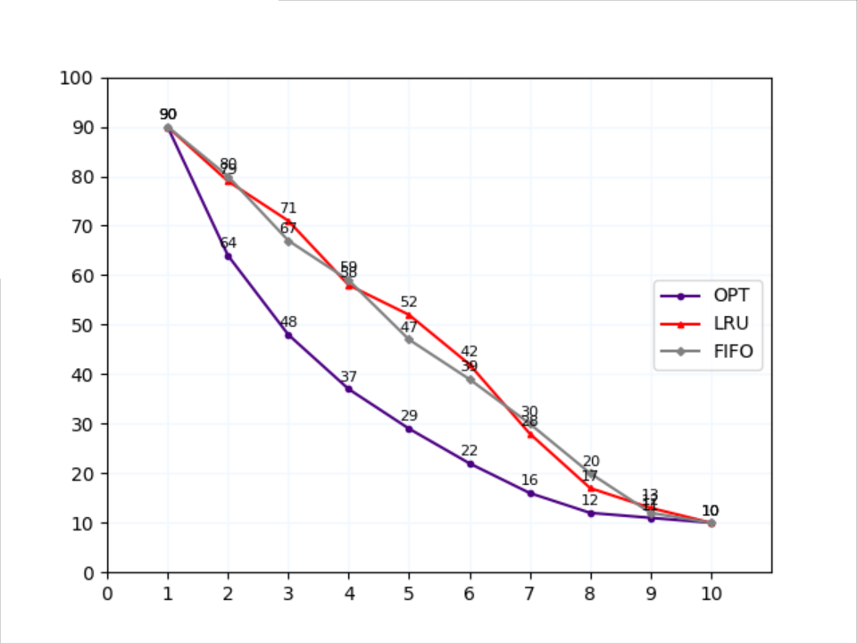

# buaa-os-3rd-theoritical-OPT_LRU_FIFO
假设有10个页面，n个页框。页面的访问顺序为0, 9, 8, 4, 4, 3, 6, 5, 1, 5, 0, 2, 1, 1, 1, 1, 8, 8, 5, 3, 9, 8, 9, 9, 6, 1, 8, 4, 6, 4, 3, 7, 1, 3, 2, 9, 8, 6, 2, 9, 2, 7, 2, 7, 8, 4, 2, 3, 0, 1, 9, 4, 7, 1, 5, 9, 1, 7, 3, 4, 3, 7, 1, 0, 3, 5, 9, 9, 4, 9, 6, 1, 7, 5, 9, 4, 9, 7, 3, 6, 7, 7, 4, 5, 3, 5, 3, 1, 5, 6, 1, 1, 9, 6, 6, 4, 0, 9, 4, 3。当n在[1,10]中取值时，请编写程序实现OPT、LRU、FIFO页面置换算法，并根据页面访问顺序模拟执行，分别计算缺页数量，画出缺页数量随页框数n的变化曲线（3条线）。

